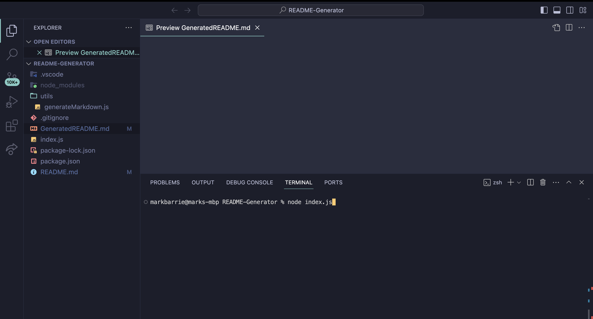
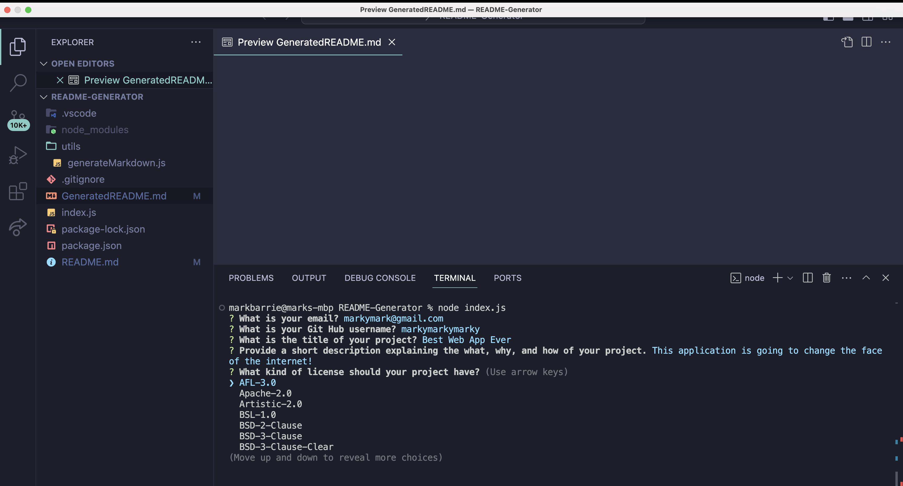
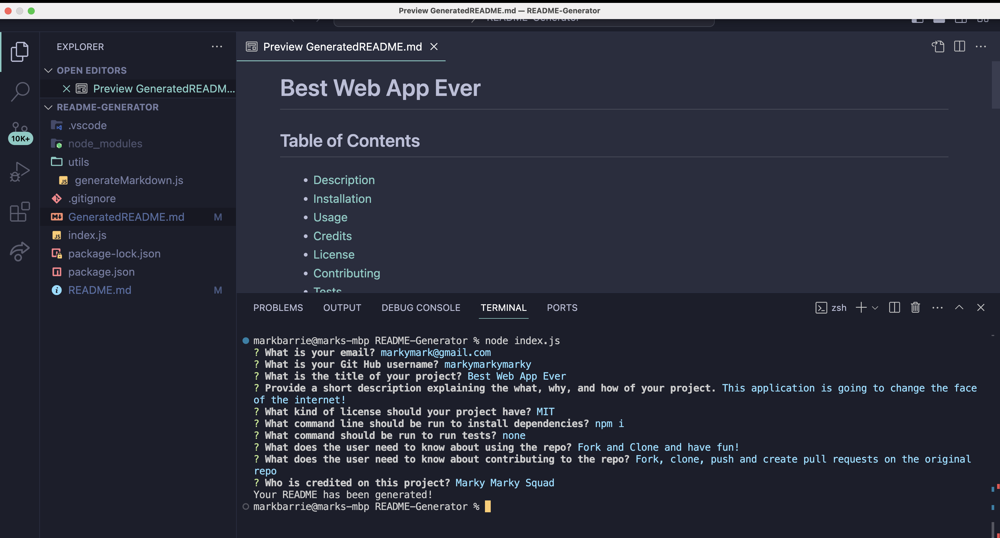
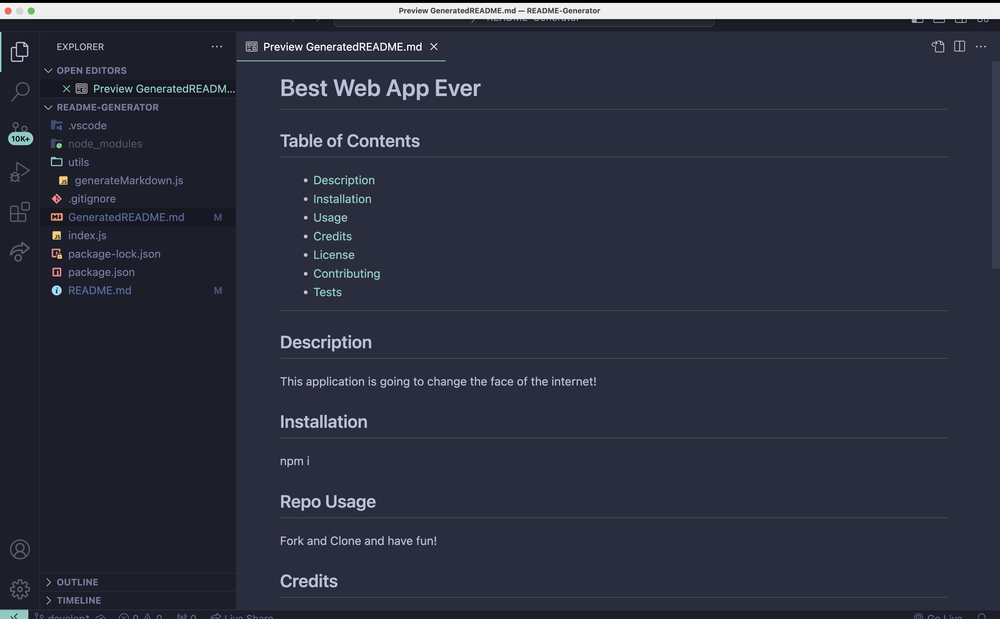
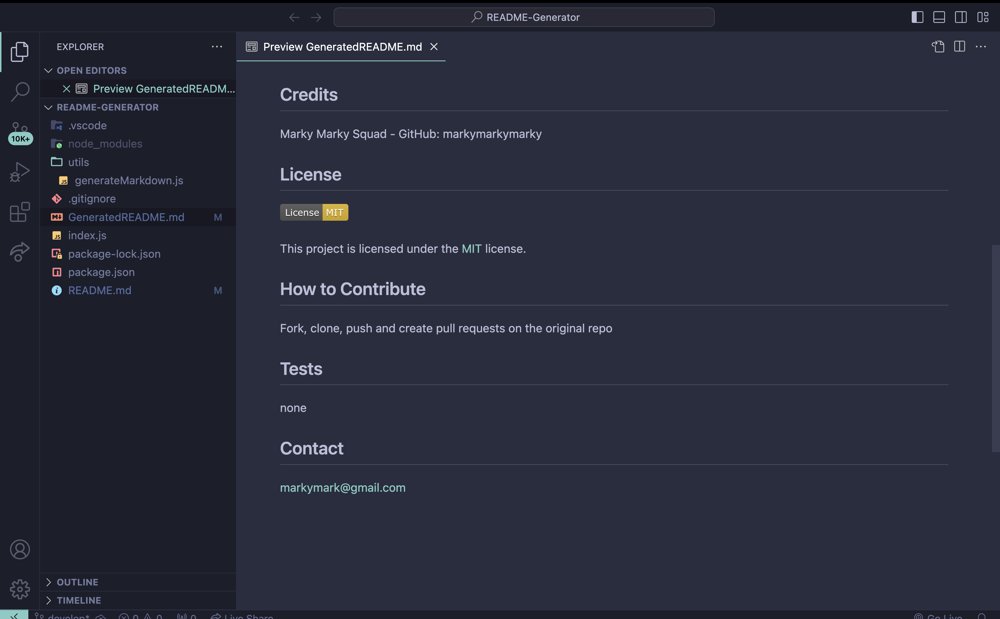

# README Generator

Thank you for checking out my Project! This project is designed to simplify your development process with a command-line based application that dynamically generates a professional README file for your projects.

## Table of Contents
- [Description](#description)
- [Installation](#installation)
- [Usage](#repo-usage)
- [Credits](#credits)
- [License](#license)
- [Contributing](#how-to-contribute)
- [Tests](#tests)
- [Screenshots](#screenshots)
- [Video Demonstration](#video-demonstration)
- [Contact](#contact)

---------

## Description
The README Generator Project is a command-line application that generates README.md files for your GitHub projects. It prompts the user for project details such as title, description, installation instructions, usage, contribution guidelines, and more.

## Installation
To install the necessary dependencies, run the following command: npm i

## Repo Usage
To use this repository, clone it to your local machine, install dependencies, and run the command: node index.js

Follow the prompts to enter your project details.

## Credits
- Starter code [here](https://github.com/coding-boot-camp/potential-enigma)
- Mark Barrie - further development - GitHub: [mbarrie1979](https://github.com/mbarrie1979)

## License
none

## How to Contribute
We welcome contributions to the README Generator Project. Please read the contribution guidelines before submitting a pull request.

## Tests
none

## Screenshots
Below are screenshots demonstrating the application functionality:

## Video Demonstration
Watch a video demonstration of the application [here](https://watch.screencastify.com/v/NlYhOrVsTDLnjJb8RB3p).

## Contact
For any questions or inquiries, please contact me at [mark.a.barrie@gmail.com](mailto:mark.a.barrie@gmail.com).
